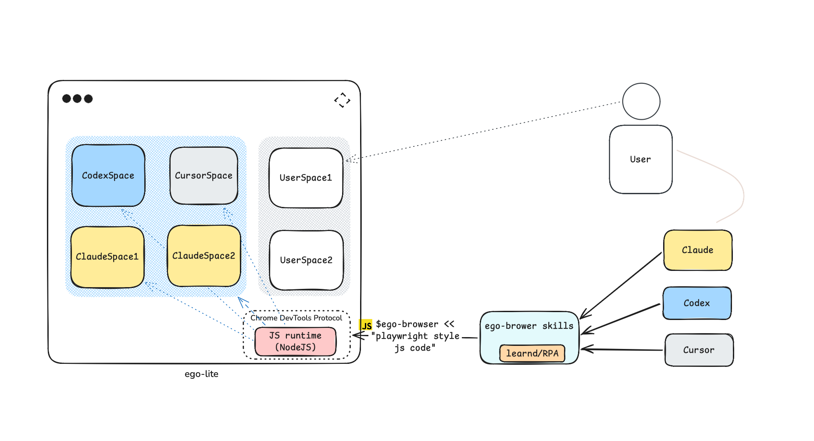

# Contributing to ego-browser

Thanks for contributing! This repository contains the **JavaScript SDK and agent
Skill** used by ego lite. The browser application and its native bindings are
provided separately by the installed ego lite app.



For the product overview, see [README.md](README.md). For the agent-facing API,
read [SKILL.md](skills/ego-browser/SKILL.md) and the generated
[API reference](skills/ego-browser/references/api.md). Repository conventions live
in [AGENTS.md](AGENTS.md).

## Set up and build

Install Node.js **22 or later** and npm. Real-browser development also requires
ego lite with onboarding complete and its `ego-browser` CLI available on `PATH`.

From the repository root:

```bash
cd package/ego-browser
npm ci
npm run build
```

Unless stated otherwise, the commands below run from `package/ego-browser/`.
Local dependency installation also installs the Git hooks configured in
[lefthook.yml](lefthook.yml).

## Understand the build output

`npm run build` regenerates `package/ego-browser/dist/`:

| Output                  | Purpose                                                                                                                    |
| ----------------------- | -------------------------------------------------------------------------------------------------------------------------- |
| `dist/out/index.js`     | The single-file ESM SDK loaded by the ego lite CLI or embedded host. Use this file for browser debugging and distribution. |
| `dist/out/ego-browser/` | The matching Skill package: `SKILL.md`, `references/`, `scripts/`, and `learnings/`.                                       |
| `dist/src/`             | Compiled runtime modules used by the repository's unit tests.                                                              |
| `dist/scripts/`         | Compiled TypeScript maintenance scripts, including the site-learning validator.                                            |

The release payload is the contents of `dist/out/`: `index.js` and the adjacent
`ego-browser/` directory. Keep them together when copying a standalone payload so
the SDK can discover its matching Skill resources. `dist/src/index.js` is not the
single-file release entry point.

Edit source files under `src/`, `scripts/`, or `skills/ego-browser/`, then rebuild.
Build output is generated and must not be committed. The build replaces `dist/`
and uses `.build.lock` to prevent concurrent builds.

## Run the SDK in ego lite

### Load a build for one command

Pass the absolute bundle path to the installed CLI:

```bash
ego-browser nodejs --sdk-path "$PWD/dist/out/index.js" <<'EOF'
console.log(help());
EOF
```

Use the same invocation for a browser script written against the current
TaskSpace/Page API. The installed CLI supplies the native `globalThis.ego`
bindings; the repository supplies the SDK. `--sdk-path` applies to that command,
so repeat it for each invocation that should use this build.

For inspecting the SDK without connecting to the browser, the repository's
standalone CLI reads JavaScript directly from stdin:

```bash
node dist/out/index.js <<'EOF'
console.log(await help());
EOF
```

Browser actions still require the native environment provided by ego lite. The
standalone repository CLI does not take the installed CLI's `nodejs` subcommand.

### Use the macOS debug SDK path

For repeated local debugging, ego lite can load the SDK from:

```text
~/Library/Application Support/Citro Labs/debug/index.js
```

Link this path to the build output. Preserve any existing debug file or symlink
before setting up a different checkout. For a new debug entry:

```bash
ego_debug_dir="$HOME/Library/Application Support/Citro Labs/debug"
mkdir -p "$ego_debug_dir"
ln -s "$PWD/dist/out/index.js" "$ego_debug_dir/index.js"
```

Use the absolute source path and quote the destination because it contains
spaces. The link lets a new CLI invocation use the latest build without copying
the SDK after every edit:

```bash
npm run build
ego-browser nodejs <<'EOF'
console.log(help());
EOF
```

Start a new invocation after rebuilding; an already running Node context does
not reload its imported SDK. Keep the checkout at the linked location. To inspect
the selected link or explicitly load the debug entry:

```bash
readlink "$HOME/Library/Application Support/Citro Labs/debug/index.js"
ego-browser nodejs \
  --sdk-path "$HOME/Library/Application Support/Citro Labs/debug/index.js" <<'EOF'
console.log(help());
EOF
```

If you prefer a copy instead of a symlink, copy the contents of `dist/out/`,
including `ego-browser/`, into the debug directory. Refresh that copy after every
build. Have your agent read the Skill from the same checkout or build as the SDK;
copying or linking JavaScript does not update the Skill already loaded in an
agent conversation.

When finished, remove the symlink you created to stop using this checkout:

```bash
rm "$HOME/Library/Application Support/Citro Labs/debug/index.js"
```

Restore a previous debug entry if you backed one up. Removing the symlink leaves
the build output intact. The debug override affects normal CLI invocations, so
use `--sdk-path` when a command needs to select a particular bundle explicitly.

For additional CLI setup and troubleshooting, see
[local runtime development](docs/local-runtime-development.md).

## Verify a change

| Command                        | What it checks                                                                                                                                         |
| ------------------------------ | ------------------------------------------------------------------------------------------------------------------------------------------------------ |
| `npm test`                     | Builds the SDK, checks the generated API reference and any local Skill translation, typechecks, then runs `src/**/*.test.mjs` with Node's test runner. |
| `npm run style:check`          | Checks formatting of runtime source, build scripts, and package documentation.                                                                         |
| `npm run validate:site-skills` | Builds and validates the site-learning packs. Run this when changing their manifests, tools, notes, or validation code.                                |
| `npm run e2e`                  | Builds the current checkout and runs the complete real-browser suite with its SDK.                                                                     |

Tests live next to the runtime source and use `node:assert/strict`, injected
service overrides, or fake native bindings. Add a regression that demonstrates a
bug before changing its implementation, and verify the behavior after the fix.

Run the real-browser suite for changes to browser behavior, sessions, targeting,
or task-space lifecycle. It starts a local fixture server, creates a unique
temporary task space, loads the current build through `--sdk-path`, and cleans up.
It does not depend on the debug override above. Do not manually switch its task
space, take control, or change the SDK while it is running. On macOS it selects
the ego lite app's CLI; use `EGO_BROWSER_REAL_E2E_CLI` to select another installed
ego lite CLI explicitly.

## Find the code to change

| Location                                                                                | Responsibility                                                                         |
| --------------------------------------------------------------------------------------- | -------------------------------------------------------------------------------------- |
| `package/ego-browser/src/index.ts`, `run.ts`, `helpers.ts`                              | SDK installation, script execution, and injected helpers.                              |
| `package/ego-browser/src/page-model.ts`                                                 | TaskSpace/Page lifecycle and the agent-facing operations.                              |
| `package/ego-browser/src/public-api-schema.ts`                                          | Public API validation, help, and generated reference definitions.                      |
| `package/ego-browser/src/browser-runtime.ts`                                            | Native CDP transport, sessions, events, and dialogs.                                   |
| `package/ego-browser/src/element-resolver.ts`, `page-ref-registry.ts`, `page-ledger.ts` | Element resolution and durable Page/ref identity.                                      |
| `package/ego-browser/src/driver/`                                                       | Browser action, input, observation, and wait implementations.                          |
| `package/ego-browser/scripts/real-browser-e2e/`                                         | Real-browser fixtures and regression cases.                                            |
| `skills/ego-browser/`                                                                   | The canonical Skill, generated API reference, installation script, and site learnings. |

Keep changes focused and match the surrounding style. Runtime code uses ESM,
TypeScript, and `.js` import extensions. Classify element-resolution failures
honestly as transient or permanent because retry behavior depends on them.

When changing a public API, update its schema, implementation, regression tests,
and Skill together. Regenerate the reference with:

```bash
npm run generate:api-docs
```

Keep reusable site behavior in `skills/ego-browser/learnings/<site>/`. Start from
an existing pack, declare its tools in `manifest.json`, and use stable URLs and
selectors. Do not put credentials or one-off task history in learning packs.

## Submit a pull request

Start from the latest branch you intend to target. Current v2 work targets
`2.0.0-beta-dev`; feature and fix branches should use a descriptive name such as
`fix/page-ref-lifetime` or `docs/local-sdk-setup`.

Use a focused commit message such as `fix(ego-browser): preserve refs across
input actions`. In the PR, explain the problem, the resulting behavior, and how
you verified it. Call out public API or Skill changes, and add an appropriate
release-note label such as `fix`, `feat`, `docs`, or `ci`.

The pre-commit hooks select checks based on the staged files. Their freshness
check currently compares against `origin/dev`. For a beta-targeted PR, verify
that the latest `origin/2.0.0-beta-dev` is an ancestor of your branch; if the dev
check is inapplicable, exclude only `branch-up-to-date` with
`LEFTHOOK_EXCLUDE=branch-up-to-date` for that commit. Keep the other checks enabled.

## CI and releases

[CI](.github/workflows/ci.yml) runs on pull requests, pushes to `dev` and `main`,
and version tags. It installs dependencies, checks formatting and dependency
vulnerabilities, runs `npm test`, and validates site learnings. The real-browser
E2E suite is a local gate and is not run by this GitHub-hosted workflow.

The current release behavior is:

| Trigger                                       | Result                                                                                              |
| --------------------------------------------- | --------------------------------------------------------------------------------------------------- |
| Push a `vX.Y.Z-beta.N` tag                    | Creates a beta prerelease **Draft**.                                                                |
| Push a `vX.Y.Z` tag                           | Publishes a stable release and marks it as Latest. The tagged commit must be reachable from `main`. |
| Push to `dev` or `main` without a version tag | Runs CI without creating a release.                                                                 |

Release jobs reuse the tested build and package `dist/out/` into
`ego-browser-<tag>.zip`. Notes are generated from merged PRs using
[release categories](.github/release.yml). The workflow publishes the SDK and
Skill payload, not the ego lite browser application or its installer.
